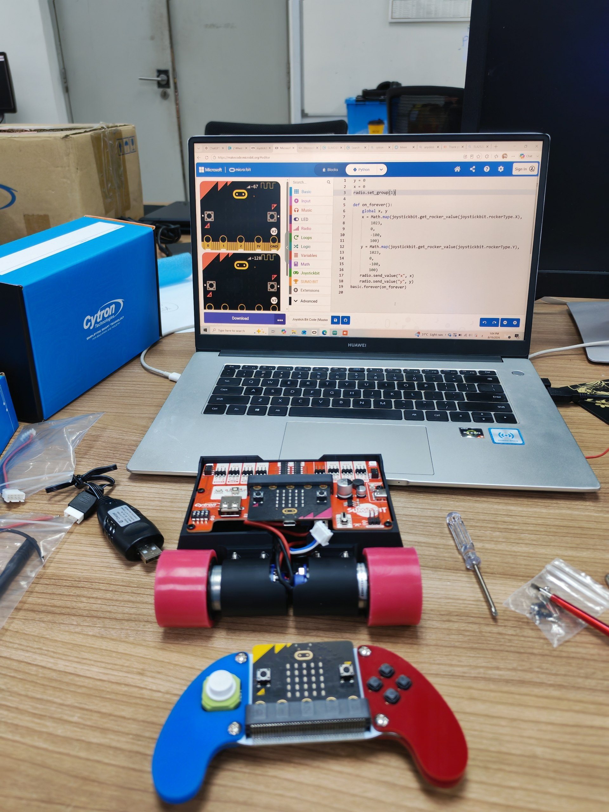
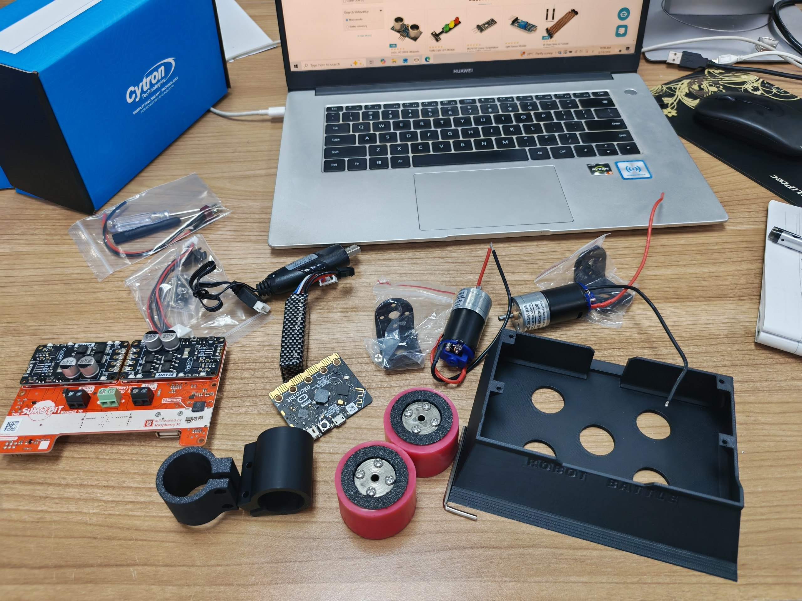
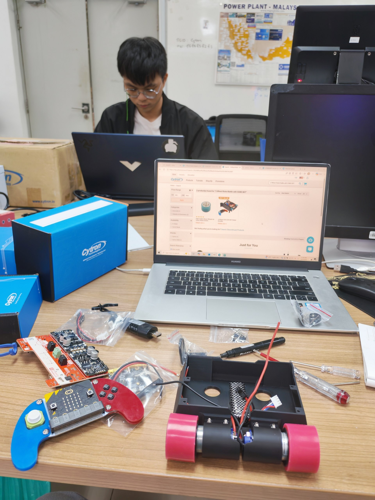
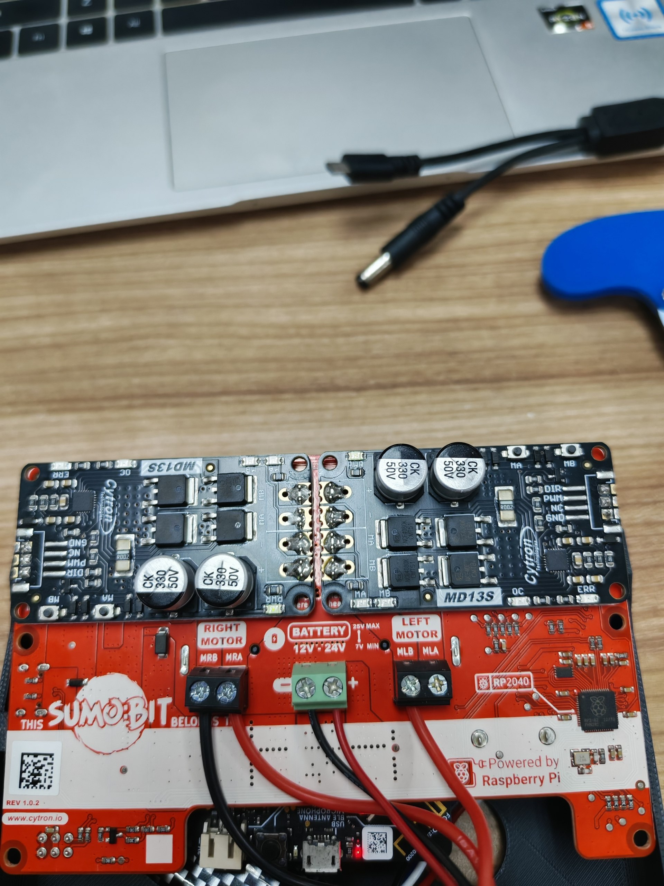
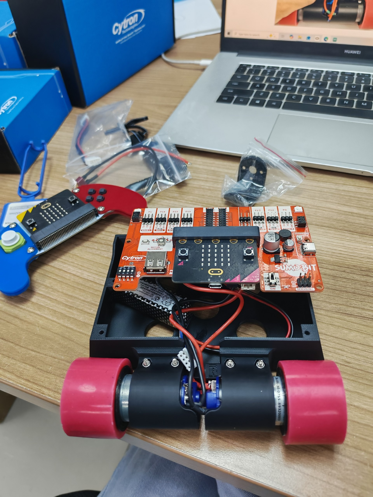
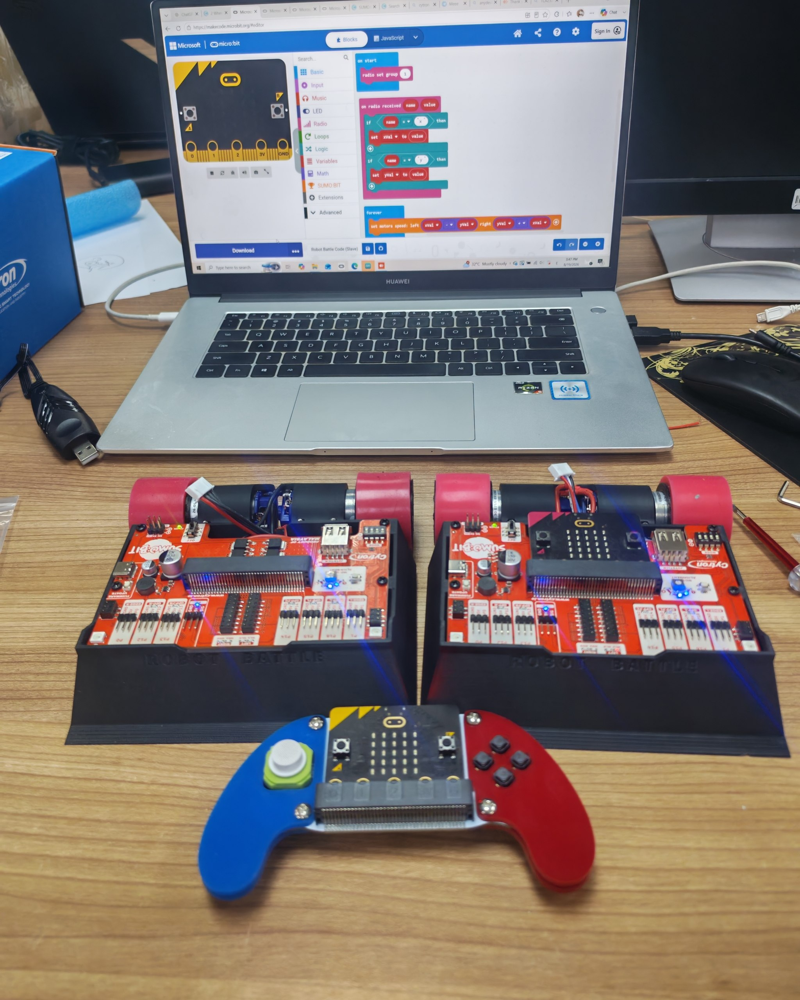

# SUMOBIT Robot Wireless Control


Wireless control system for the Cytron SUMOBIT robot using BBC micro:bit radio communication and a GHBit wireless controller.

---

## Project Overview

This project demonstrates a wireless control system for the Cytron SUMOBIT robot.

The system uses two BBC micro:bit boards. One micro:bit is connected to the GHBit controller and works as the transmitter, while another micro:bit is connected to the SUMOBIT robot and works as the receiver.

The GHBit controller sends wireless commands using the BBC micro:bit radio communication system. The SUMOBIT robot receives these commands and controls its two DC motors accordingly.

---

## Features

- Wireless robot control using BBC micro:bit radio communication
- Forward movement
- Backward movement
- Left movement
- Right movement
- Stop command
- GHBit joystick control
- Additional GHBit buttons for extra wireless commands
- SUMOBIT dual DC motor control

---

## Project Structure

```text
SUMOBIT-Robot-Wireless-Control/
│
├── README.md
├── LICENSE
│
├── images/
│   ├── completed_robot.jpg
│   ├── hardware_components.jpg
│   ├── motor_power_connection.jpg
│   ├── programming.jpg
│   ├── robot_assembly.jpg
│   └── robot_controller.jpg
│
└── code/
    ├── SUMOBIT_Robot_Code.py
    └── GHBit_Controller_Code.js
```

---

# Robot Assembly

## 1. SUMOBIT Robot and GHBit Controller

The project consists of the SUMOBIT robot and the GHBit wireless controller.

The robot uses two DC motors for movement, while the GHBit controller uses a joystick to send wireless commands to the robot.



**Figure 1.** SUMOBIT robot and GHBit wireless controller.

---

## 2. Hardware Components

The main hardware components include the SUMOBIT robot chassis, DC motors, wheels, motor driver board, BBC micro:bit, GHBit wireless controller, battery connection, and related cables and components.



**Figure 2.** Hardware components used in the project.

---

## 3. Robot Assembly

The robot chassis was assembled by installing the motors, wheels, motor driver board, and BBC micro:bit.



**Figure 3.** SUMOBIT robot during the assembly process.

---

## 4. Motor Driver and Power Connection

The battery is connected to the motor driver board, which controls the right and left motors according to the wireless commands received by the robot.



**Figure 4.** SUMOBIT motor driver board and battery connection.

---

# GHBit Controller

## 5. Controller Setup

The GHBit controller contains a joystick for directional control and additional buttons for sending extra wireless commands.

The joystick is used for the main movement commands:

- Up → Forward
- Down → Backward
- Left → Turn Left
- Right → Turn Right
- Center Press → Stop


**Figure 5.** GHBit wireless controller used to control the SUMOBIT robot.

---

# Wireless Control System

## 6. Complete Wireless System

The controller sends movement commands wirelessly to the SUMOBIT robot using the BBC micro:bit radio communication system.

Both the transmitter and receiver are configured to use the same radio group.



**Figure 6.** Complete wireless control system with the SUMOBIT robot and GHBit controller.

---

# Programming

## 7. Programming and Testing

The BBC micro:bit and GHBit controller were programmed using the MakeCode environment.

The controller continuously reads the joystick direction and sends the corresponding wireless command to the SUMOBIT robot through radio communication.

The robot receives the command and controls both DC motors accordingly.



**Figure 7.** Programming and testing the wireless control system.

---

# System Operation

The system operates using the following process:

```text
GHBit Controller
       │
       ▼
Joystick Input
       │
       ▼
BBC micro:bit Transmitter
       │
       │ Radio Communication
       ▼
BBC micro:bit Receiver
       │
       ▼
SUMOBIT Motor Driver
       │
       ▼
DC Motors
       │
       ▼
Robot Movement
```

---

# Wireless Commands

The following commands are used for robot movement:

| Command | Action |
|---|---|
| `A` | Move Forward |
| `B` | Move Backward |
| `C` | Turn Left |
| `D` | Turn Right |
| `0` | Stop |
| `E` | Additional Button Command |
| `F` | Additional Button Command |
| `G` | Additional Button Command |
| `H` | Additional Button Command |

---

# Robot Receiver Code

The robot receives wireless string commands and controls the SUMOBIT motors.

The receiver uses the following movement logic:

- `A` → Both motors move forward
- `B` → Both motors move backward
- `C` → Turn left
- `D` → Turn right
- `0` → Stop both motors

The complete robot receiver code is available here:

[Open SUMOBIT Robot Code](./code/SUMOBIT_Robot_Code.py)

---

# GHBit Controller Code

The GHBit controller reads the joystick direction and sends wireless commands using the BBC micro:bit radio communication system.

The radio settings used in the project are:

- Radio Group: `1`
- Transmit Power: `7`

The complete GHBit controller code is available here:

[Open GHBit Controller Code](./code/GHBit_Controller_Code.js)

---

# Required Hardware

The following hardware is used in this project:

- Cytron SUMOBIT Robot
- BBC micro:bit for the robot
- BBC micro:bit for the controller
- GHBit Wireless Controller
- DC Motors
- Motor Driver Board
- Robot Wheels
- Battery
- Connection Cables

---

# How to Use

## Step 1: Prepare the Robot

Assemble the SUMOBIT robot by installing the motors, wheels, motor driver board, battery connection, and BBC micro:bit.

---

## Step 2: Upload the Robot Code

Upload the receiver code to the BBC micro:bit connected to the SUMOBIT robot.

The robot micro:bit will listen for wireless commands from the controller.

---

## Step 3: Upload the Controller Code

Upload the GHBit controller code to the BBC micro:bit connected to the GHBit controller.

The controller micro:bit will read the joystick input and transmit wireless commands.

---

## Step 4: Use the Same Radio Group

Make sure that both BBC micro:bit boards use the same radio group:

```text
Radio Group: 1
```

This allows the controller and robot to communicate wirelessly.

---

## Step 5: Control the Robot

Use the GHBit joystick to control the robot:

- Push Up to move forward
- Push Down to move backward
- Push Left to turn left
- Push Right to turn right
- Press the joystick to stop the robot
- Release the joystick to stop the robot

---

# Project Demonstration

The final system allows the SUMOBIT robot to be controlled wirelessly using the GHBit controller.

The controller sends commands through BBC micro:bit radio communication, and the robot responds by controlling its two DC motors.


**Final SUMOBIT Robot Wireless Control System.**

---

# Author

**Adel Husham Mohamedain**

Electrical Engineering Student  
Universiti Malaysia Perlis (UniMAP)

---

# License

This project is licensed under the MIT License.

See the [LICENSE](./LICENSE) file for more information.
